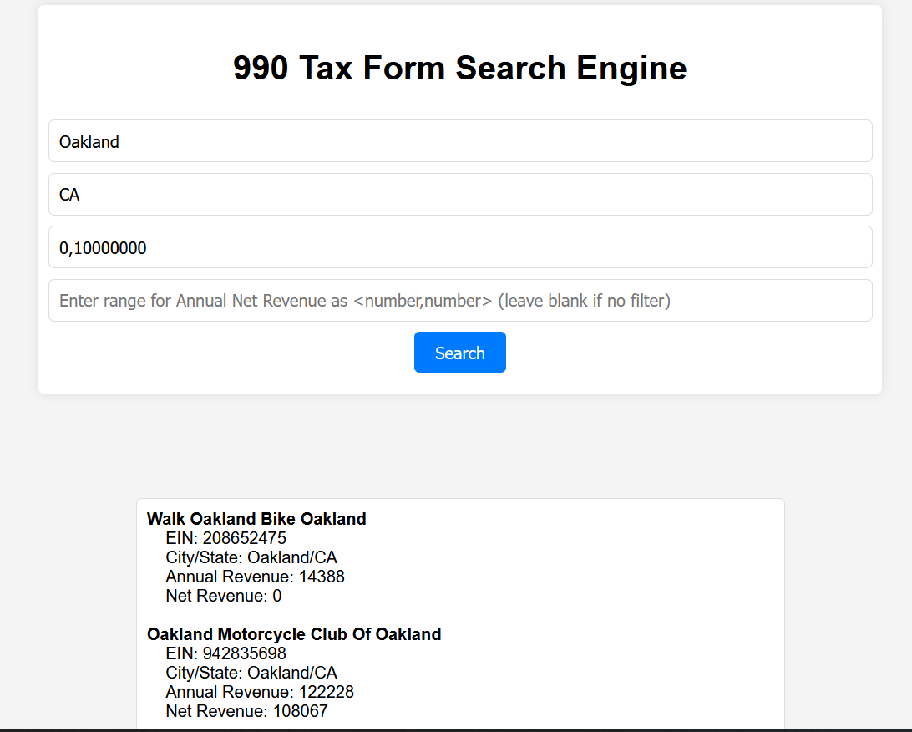

# Legends ASDA Documentatoin
Welcome to a prototype search engine for 990 tax forms

## Getting Started
It's a website so everything can run locally in your browser! All that's required is to clone the repository and run `flask run` to get updated tax data

### Dependencies
- Python2 to grab tax forms once a year
- python flask library
- python json library

### Supported Features
- US City/State filtering 
- Gross revenue 
- Net revenue
